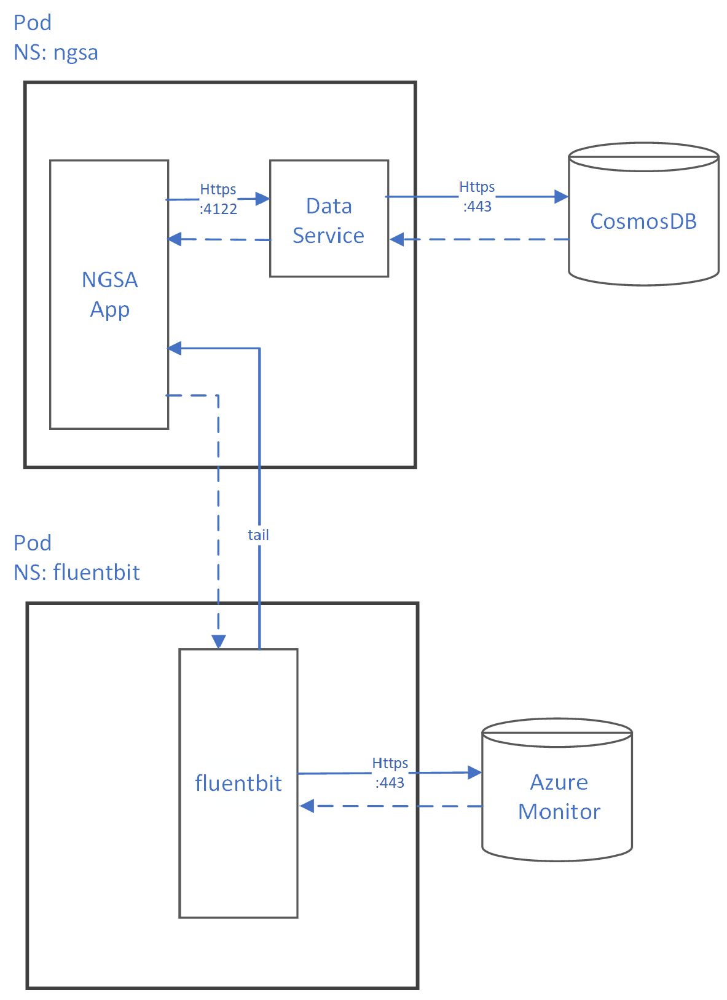

# Application Architecture

This file will describe various design aspects and capabilities that are part of the NGSA Platform Validation Application.  This application is meant to act as a production level service that is intended to deployed to a Kubernetes cluster and used for various forms of validation testing.

## High Level Architecture

TODO

## Data Service Design

We wish to fully separate the service used to read and write data from the front-end services that act as brokers of the data to the calling clients.  This provides deployment flexibility and isolates interactions with the data which eases synchronization needs, data caching implementation, and access semantics for the clients.

<!-- markdownlint-disable MD033 -->
<!-- couldn't get sizing to work in standard markdown -->

`Data Service POD Topology`

### Data Service Caching

WIP - The Data Service will use a cache-aside mechanism for results.  

### Data Service Logging

All expected logs are sent to `stdout`.

All errors (e.g., 500 returns) are sent to `stderr`.

### Correlation Vectors

### Deployment YAML

[TODO]
