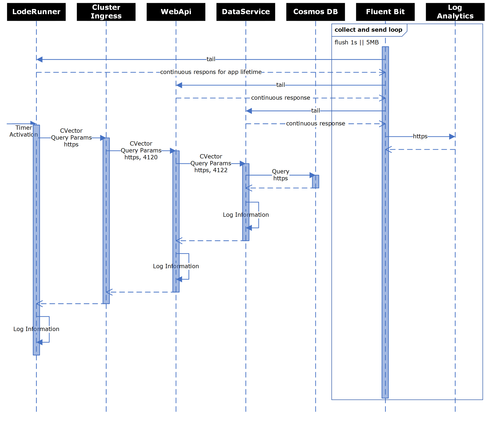

# Application Architecture

This file will describe various design aspects and capabilities that are part of the NGSA Platform Validation Application.  This application is meant to act as a production level service that is intended to deployed to a Kubernetes cluster and used for various forms of validation testing.

## High-level Architecture

The application is made of several components that are intended to validate the platform deployment and help identify issues with platform changes by running a continuous battery of tests.

<!-- markdownlint-disable MD033 -->
<!-- couldn't get sizing to work in standard markdown -->

`NGSA Request Sequence`

The sequence above illustrates the flow from the test tool (LodeRunner) through the platform and application.  In addition, it depicts the continual collection of log information by Fluent Bit which is shaped and sent to Log Analytics.  Of note, the Correlation Vector (CVector) that is passed from caller into the services is used throughout the call chain and recorded in the logs so that single requests chains may be identified and inspected during research.

## Data Service Design

We wish to fully separate the service used to read and write data from the front-end services that act as brokers of the data to the calling clients.  This provides deployment flexibility and isolates interactions with the data which eases synchronization needs, data caching implementation, and access semantics for the clients.

<!-- markdownlint-disable MD033 -->
<!-- couldn't get sizing to work in standard markdown -->

`Data Service POD Topology`

### Data Service Caching

The initial implementation of the Data Service uses a cache-aside mechanism built using `System.Runtime.Caching`.  The flags for controlling cache behavior are as follows:

#### Default Behavior

- always cache
- `--cache-duration` = 300 seconds

#### Runtime Flags

The following flags are mutually exclusive:
`--in-memory`: [0|1]
`--no-cache` (never cache): [0|1]
`--perf-cache` (req/sec limit): int
`--cache-duration` = int

Validation:
`--cache-duration`: int > 0
`--perf-cache`: int > 0

### Data Service Logging

All expected logs are sent to `stdout`.

All errors (e.g., 500 returns) are sent to `stderr`.

### Correlation Vectors

The applications are using the [Microsoft Correlation Vector](https://github.com/Microsoft/CorrelationVector-CSharp) for call tracing through the system.  Each system adds the vector to the headers and adds and(or) increments a suffix.  The correlation token is logged as `CVector` and `CVectorBase`.  `CVectorBase` will have a base identifier such as `8a5d1F7yxEixuG3eLvTEew` while `CVector` will have the base plus a suffix indicating where it is in a chain of calls.  Such that `8a5d1F7yxEixuG3eLvTEew.0` is present in the first call and `8a5d1F7yxEixuG3eLvTEew.0.0` is present in a subsequent call (assuming serial calls).
