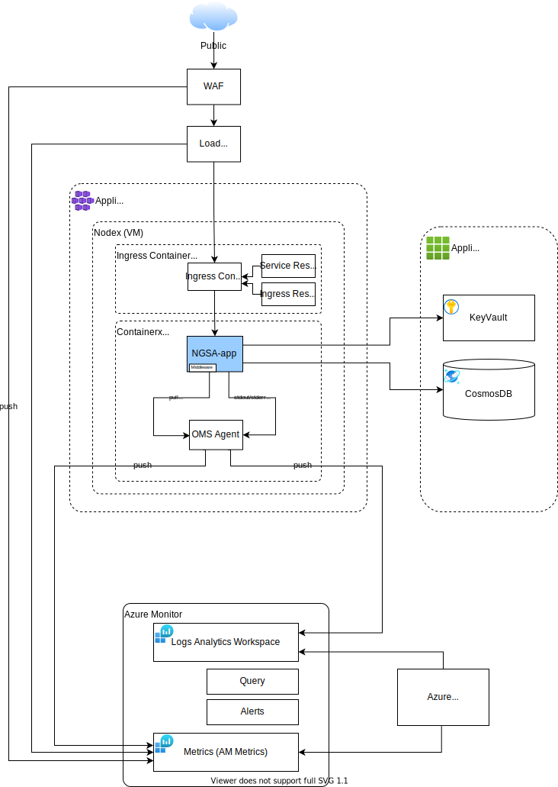
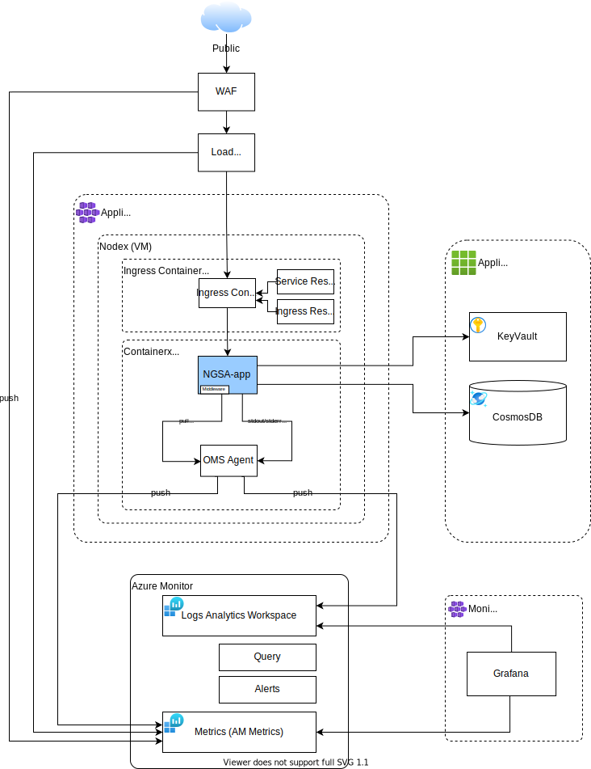
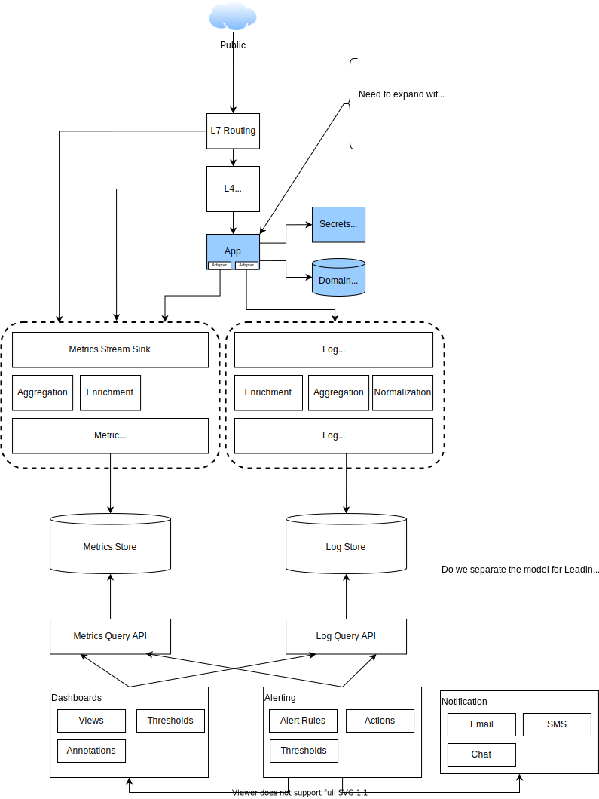

# Architecture Views

## Current State
### NGSA Dev Cluster

## Technical Views
### Azure - Native

### Azure - Native + Grafana

### Azure - Prometheus + Grafana

## Logical Views
### Single Instance

## Logical View - Environment + Application - Single Instance

# Technology
## AKS Secure Baseline

## Azure Monitor

## Prometheus

## Grafana

## PnP Request Routing - Monitoring Dev Cluster

