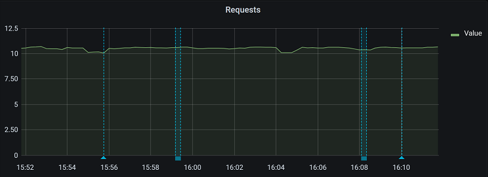

# Annotating Grafana with HTTP API

Run the `annotate_gf.bash` script to create Grafana annotation.

> Grafana URL needs to be prefixed with 'https://', otherwise the script won't work. Also auth info is required

```bash

./annotate_gf.bash
"""
./annotate_gf.bash -d 'DESCRIPTION' REQRD_ARGS [OPTIONAL ARGS] [-]
'-' at the end means: script will read user auth from stdin
./annotate_gf.bash -d 'Specific desc' -i 4 --panel-id 9 -u https://some.url:23232 -t realtag,tag2 - <<< "$auth_bash_var"
./annotate_gf.bash -d 'Runnin load' --dashboard-id 2 -p 6 -u https://some.url:23232 -r 1616836775,1616836795

Required args:
    -d | --description DESCRPTN     Annotation description
    -i | --dashboard-id ID          Dashboard ID
    -p | --panel-id ID              Panel ID
    -u | --url URL                  Grafana URL:Port. Prefix must be https://
                                    Example: https://grafana.abcd.net:31222
Optional args:
    -t | --tags COMMA-SEP-TAGS      List of comma separated Annotation Tags
    -r | --time-range START,END     Annotation start and end time in EPOCH seconds
                                    separated by comma
Optional Flags:
    -h | --help                     Show the usage
"""
```

## Passing Auth info

It expects basic auth info in the form of user:pass

- Passing '-' at the end, the script will read auth info from stdin
    e.g.
    `echo $AUTH_VAR | ./annotate_gf.bash -d desc -i 4 -p 4 -u grafana-url.com -`

    `./annotate_gf.bash -d desc -i 4 -p 2 -u https://grafana-url.com - <<< "$AUTH_VAR"`

    `./annotate_gf.bash -d desc -i 4 -p 6 -u https://localhost:10000 - <<< "$AUTH_VAR"`
- Export environment variable named `GRAFANA_USER_PASS` and call this script without '-' at the end

    `./annotate_gf.bash -d desc -i 4 -p 4 -u https://some.grafana.url:32000`

## Finding Grafana Dashboard ID and Panel ID

From the Grafana web portal:

Open your Dashboard -> _Dashboard settings_ (gear icon at the top) -> _JSON Model_

In that JSON,

- `.id` is the dashboard ID
- `.panels[]` array contains all panels from current dashboard
- Under each array inside `.panels[]`, search for your panel name (.e.g Requests) under `.title` and note the panel ID from `.id`

## Example usage

```bash

# HTTP url will not work
./annotate_gf.bash -d "Load test for 'The REASON'" -i 4 -p 2 -u http://localhost:32000

# It will print the line below, since the url needs to have https://
Only HTTPS is supported

# Create an annotation with username and pass as args:
./annotate_gf.bash -d "Test Arg auth" -i 4 -p 2 -u https://localhost:32000 - <<< "${USER_PASS_BASH_VAR}"

# Export the Env variable GRAFANA_USER_PASS in format username:pass

# Create an annotation with specific tag:
./annotate_gf.bash -d "Test auth with a Tag" -i 4 -p 2 -u https://localhost:32000 --tags dev,load

# Create an annotation with specific tag and date:
time_start=$(date +%s) # Annotation Start time
# Do some work
sleep 60
time_end=$(date +%s) # Annotation End time
./annotate_gf.bash -d "Test Ranged annotation" -i 4 -p 2 -u https://localhost:32000 --tags load,script -r $time_start,$time_end

```

## Sample Annotations in a Dashboard


