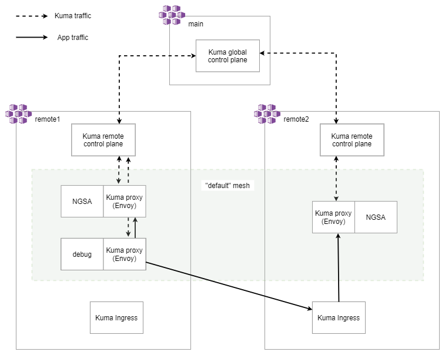

# Kuma service mesh spike

Setup a multi-cluster service mesh with Kuma

## Prerequisites

- Azure CLI ([download instructions](https://docs.microsoft.com/en-us/cli/azure/install-azure-cli))
- Kuma CLI 1.0.3 ([download instructions](https://kuma.io/docs/1.0.3/installation/kubernetes/#_1-download-kuma))

This has been tested in Ubuntu(WSL)

## Download Kuma CLI

One option is to use the installer script.

```bash

curl -L https://kuma.io/installer.sh | VERSION= 1.0.3 sh -

```

Another option is to download manually.

```bash

# Ubuntu example

# Download Kuma and extract files.
curl -sL https://kong.bintray.com/kuma/kuma-1.0.3-ubuntu-amd64.tar.gz | tar xz

# Copy kumactl to a /usr/local/bin directory.
sudo cp kuma-1.0.3/bin/kumactl /usr/local/bin/kumactl

# Check that the CLI is available.
kumactl version

```

## Setup

High level diagram



### Create clusters

setup variables

```bash

# Clone the NGSA repo.
git clone git@github.com:retaildevcrews/ngsa.git

cd ngsa/spikes/kuma-multicluster

LOCATION=centralus

# Get the available AKS versions in the location.
az aks get-versions -l $LOCATION -o table

# Choose the latest non preview version. Versions in preview, will be marked with "preview".
AKS_VERSION=1.19.3

# Choose a resource group name.
RG_NAME=kuma

```

Note:
> Zone: A zone identifies a Kubernetes cluster, a VPC, or any other cluster that we want to include in a Kuma service mesh.

Create 3 AKS clusters that we'll use for Kuma zones. One cluster will be the main zone that has the global control plane. The other two clusters will be the remote zones and have remote control planes.

```bash

# Create resource group.
az group create -n $RG_NAME -l $LOCATION

# Create clusters

# Create a cluster for the main zone.
az aks create -n main -g $RG_NAME -l $LOCATION --enable-cluster-autoscaler --min-count 1 --max-count 3 --node-count 1 -k $AKS_VERSION --no-ssh-key

# Create a cluster for the first remote zone.
az aks create -n remote1 -g $RG_NAME -l $LOCATION --enable-cluster-autoscaler --min-count 1 --max-count 3 --node-count 1 -k $AKS_VERSION --no-ssh-key

# Create a cluster for the second remote zone.
az aks create -n remote2 -g $RG_NAME -l $LOCATION --enable-cluster-autoscaler --min-count 1 --max-count 3 --node-count 1 -k $AKS_VERSION --no-ssh-key

```

Get credentials for the 3 clusters.

```bash

az aks get-credentials --resource-group $RG_NAME --name main

az aks get-credentials --resource-group $RG_NAME --name remote1

az aks get-credentials --resource-group $RG_NAME --name remote2

```

### Setup service mesh

Setup the global control plane in the main cluster.

```bash

# Switch kubectl context to main cluster.
kubectl config use-context main

# Install Kuma global control plane in the main cluster.
kumactl install control-plane --mode=global | kubectl apply --context main -f -

# Check that the Kuma loadbalancer is available and has an external ip address.
# The "EXTERNAL-IP" should have an IP address.
kubectl get service kuma-global-remote-sync --namespace kuma-system --context main

# Get the external ip address of global service.
LOAD_BALANCER_ADDRESS=$(kubectl get service kuma-global-remote-sync --namespace kuma-system --context main -o jsonpath="{.status.loadBalancer.ingress[0].ip}")

# Set the address of the global control plane. The remote zones will communicate with global control plane at this address.
GLOBAL_ADDRESS="grpcs://${LOAD_BALANCER_ADDRESS}:5685"

# Enable mTLS to allow cross cluster traffic between the services in the mesh.
kubectl apply -f mesh.yaml --context main

```

Setup the first remote control plane in the remote1 AKS cluster.

```bash

# Switch kubectl context to remote1 cluster.
kubectl config use-context remote1

# Install Kuma remote control plane.
kumactl install control-plane --mode=remote --zone=remote1 --ingress-enabled --kds-global-address $GLOBAL_ADDRESS | kubectl apply --context remote1 -f -

# Configure Kuma DNS.
kumactl install dns | kubectl apply --context remote1 -f -

```

setup remote2 kuma zone

```bash

# Switch kubectl context to remote2 cluster.
kubectl config use-context remote2

# Install Kuma remote control plane.
kumactl install control-plane --mode=remote --zone=remote2 --ingress-enabled --kds-global-address $GLOBAL_ADDRESS | kubectl apply --context remote2 -f -

# Configure Kuma DNS.
kumactl install dns | kubectl apply --context remote2 -f -

```

### Deploy apps in mesh

Deploy different versions of the NGSA app in the two Kuma zones. The app versions will be used to test the cross cluster routing.

```bash

# Deploy one version to remote1.
NGSA_IMAGE_TAG="beta-0.0.8-1215-2142-117" envsubst < ngsa.yaml | kubectl apply --context remote1 -f -

# Make sure pods are running.
kubectl get pods --namespace kuma-spike --context remote1

# Deploy a different version to remote2.
NGSA_IMAGE_TAG="beta-0.0.8-1215-1946-115" envsubst < ngsa.yaml | kubectl apply --context remote2 -f -

# Make sure pods are running.
kubectl get pods --namespace kuma-spike --context remote2

```

Test the app in remote1 is working as expeted.

```bash

# Connect to the NGSA service in remote1.
kubectl port-forward svc/ngsa-memory 4120:4120 --namespace kuma-spike --context remote1

# In another terminal or in a browser browser, check the app version
# http://localhost:4120/version

curl http://localhost:4120/version

```

Test the app in remote2 is working as expeted.

```bash

# Connect to the NGSA service in remote2.
kubectl port-forward svc/ngsa-memory 4120:4120 --namespace kuma-spike --context remote2

# In another terminal or in a browser browser, check the app version
# http://localhost:4120/version

curl http://localhost:4120/version

```

### Traffic routing

Add a debugging pod to the service mesh. This will be used to send traffic to our services and observe routing changes.

```bash

# Add a debugging pod to remote1.
kubectl apply -f debug.yaml --context remote1

# Make sure pods are running.
kubectl get pods --namespace kuma-spike --context remote1

# Conenct to the debug container.
kubectl exec -it debug --namespace kuma-spike --context remote1 --container debug -- /bin/sh

```

Inside the container,

```bash

# Install curl.
apk --update add curl

# Send traffic to the ngsa-memory service.
watch -n 1 curl http://ngsa-memory:4120/version

# Notice that the "appVersion" field is changing between the different versions that were installed in the remote kuma zones.

# Keep this terminal open, and open a new terminal.

```

Open a new terminal. Update the balance of traffic between remote1 and remote2. Labels will be used to control the routing destinations.

```bash

# Add a label to the NGSA pods. These labels will be used for routing

# Label remote1 pod.
kubectl label pod ngsa-memory --namespace kuma-spike kuma-zone=remote1 --context remote1

# Label remote2 pod.
kubectl label pod ngsa-memory --namespace kuma-spike kuma-zone=remote2 --context remote2

```

Use [traffic_route.yaml](./traffic_route.yaml) to adjust traffic in the mesh. This traffic policy is set to send all traffic to the service that is running in remote1.

```yaml
...
  conf:
    split:
      - weight: 100
        destination:
          kuma.io/service: ngsa-memory_kuma-spike_svc_4120
          kuma-zone: "remote1"
      - weight: 0
        destination:
          kuma.io/service: ngsa-memory_kuma-spike_svc_4120
          kuma-zone: "remote2"
```

```bash

# Apply a traffic route to the global control plane in the main cluster.
kubectl apply -f traffic_route.yaml --context main

# In the previous terminal, the one connected to the debug container, notice that the version of the app is no longer changing. It is now fixed to the version running in remote1.

```

Edit the weights in `traffic_route.yaml`, and observe the behavior in the debug container. For example, change the remote1 weight to 0 and remote2 to 100.

### Kuma UI

Kuma comes with a UI.

```bash

# Connect to the global kuma control plane in the main cluster.
kubectl port-forward svc/kuma-control-plane --namespace kuma-system 5681:5681 --context main

# Open http://127.0.0.1:5681/gui/ in browser to view UI.

```
