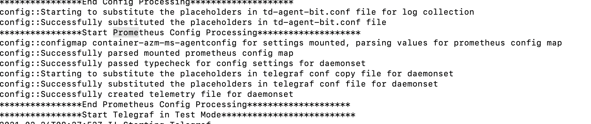
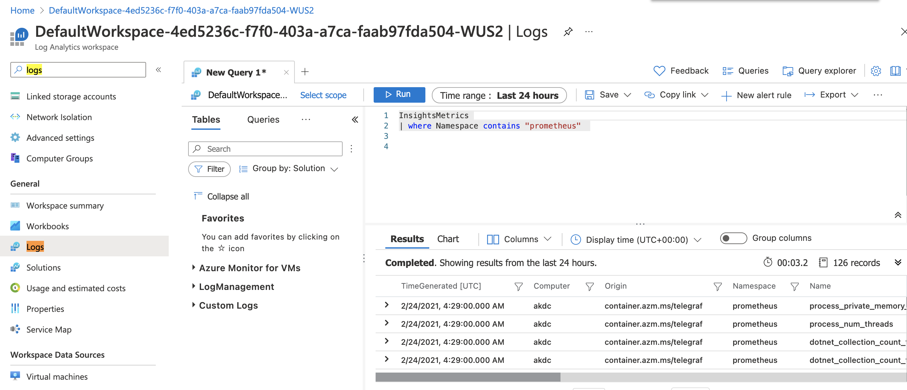

# Prometheus and Log analytics integration using OMS Agent
Prometheus is a popular open source metric monitoring solution and is a part of the Cloud Native Compute Foundation. Azure Monitor for containers provides a seamless onboarding experience to collect Prometheus metrics. Typically, to use Prometheus, you need to set up and manage a Prometheus server with a store. By integrating with Azure Monitor, a Prometheus server is not required. You just need to expose the Prometheus metrics endpoint through your exporters or pods (application), and the containerized agent for Azure Monitor for containers can scrape the metrics.

# Steps to Scrape Metrics into Log Analytics

* Save the Workspace ID and the key for log Analytics work space from the Azure dashboard 

* (Skip this step if your cluster is ion AKS and has OMS Pod running in the kube-system namesspace)
To use OMS Agent Daemon-set using Secrets, create the secrets first. 

  - Copy the script and secret template file and make sure they are on the same directory. 
	- secret generating script - secret-gen.sh
	- secret template - secret-template.yaml
  - Run the script. The script will ask for the OMS Workspace ID and Primary Key. Please insert that and the script will create a secret yaml file so you can run it.   

   ```
   #> sudo bash ./secret-gen.sh 
   ```

   - Create the secrets pod by running the following: 
  ``` kubectl create -f omsagentsecret.yaml ```
 
   - To check, run the following: 

   ``` 
   root@ubuntu16-13db:~# kubectl get secrets
   NAME                  TYPE                                  DATA      AGE
   default-token-gvl91   kubernetes.io/service-account-token   3         50d
   omsagent-secret       Opaque                                2         1d
   root@ubuntu16-13db:~# kubectl describe secrets omsagent-secret
   Name:           omsagent-secret
   Namespace:      default
   Labels:         <none>
   Annotations:    <none>

   Type:   Opaque

   Data
   ====
   WSID:   36 bytes
   KEY:    88 bytes 
   ```
  - Copy the daemon-set yaml "omsagent-ds-secrets.yaml" to your host.

  - Create your omsagent daemon-set by running ``` kubectl create -f oms-agent.yaml ```

2. Check to see whether the OMS Agent daemon-set is running fine. 
   ``` 
   root@ubuntu16-13db:~# kubectl get ds omsagent
   NAME       DESIRED   CURRENT   NODE-SELECTOR   AGE
   omsagent   3         3         <none>          1h
   ```
* Update your pod with prometheus annotations as required. Refer https://docs.microsoft.com/en-us/azure/azure-monitor/containers/container-insights-prometheus-integration for details and ngsa-memory.yaml for sample and deploy the pod.

* Update the ConfigMap in the file container-azm-ms-agentconfig.yaml as required. Refer https://docs.microsoft.com/en-us/azure/azure-monitor/containers/container-insights-prometheus-integration for details. 


   - Create the configMap  by running the following: 
  ``` kubectl create -f container-azm-ms-agentconfig.yaml ``` 

  Check for the added config map by kubectl get configmap -A

  Check the OMS agent logs with command and it should indicate the Prometheus config processing
  ``` kubectl logs -f <omsagent-pod-name> --namespace kube-system ```

  

  * Now go into the logs tab of the Log analytics workspace and type the query below you should be able to see the prometheus metrics in the azure log analytics

  ``` InsightsMetrics | where Namespace contains "prometheus"  ```

  * Create dashboards with queries . Reference : https://docs.microsoft.com/en-us/azure/azure-monitor/visualize/tutorial-logs-dashboards

  