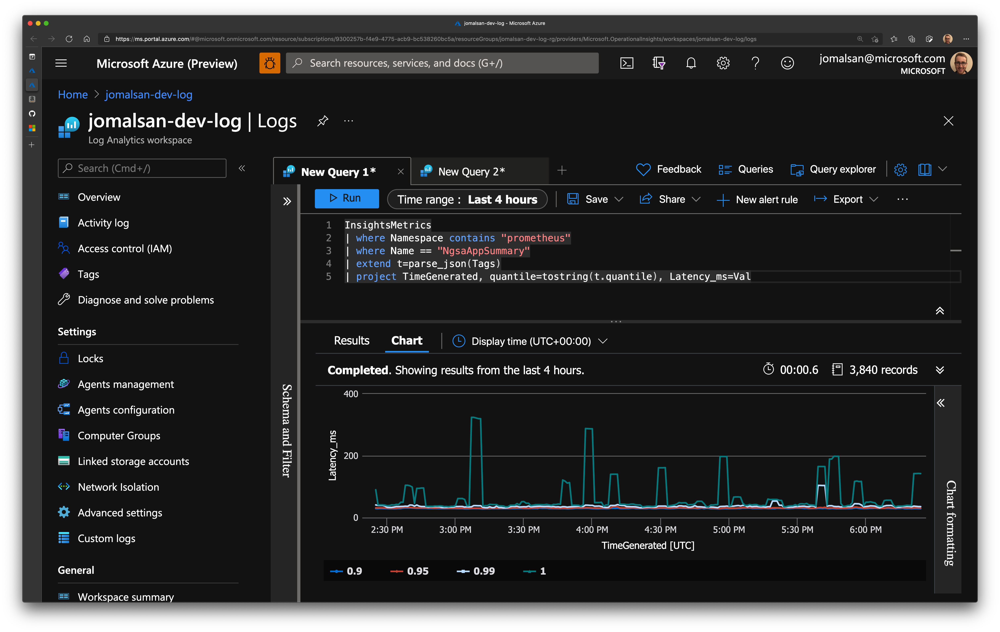

# Prometheus and Log analytics integration using OMS Agent

Prometheus is a popular open source metric monitoring solution and is a part of the Cloud Native Compute Foundation. Azure Monitor for containers provides a seamless onboarding experience to collect Prometheus metrics. Typically, to use Prometheus, you need to set up and manage a Prometheus server with a store. By integrating with Azure Monitor, a Prometheus server is not required. You just need to expose the Prometheus metrics endpoint through your exporters or pods (application), and the containerized agent for Azure Monitor for containers can scrape the metrics.

Reference Documentation [here](https://docs.microsoft.com/en-us/azure/azure-monitor/containers/container-insights-prometheus-integration).

## Installation on AKS Clusters

For non-AKS clusters please see [non-aks/README.md](non-aks/README.md).

For installing on AKS clusters, we recommend enabling Azure Monitor for Containers through your Infrastructure as Code solution.
Please see, [Enable Container Insights](https://docs.microsoft.com/en-us/azure/azure-monitor/containers/container-insights-onboard) for instructions on enabling Azure Monitor for Containers for your cluster.

For more detail on what is created, please see the YAML files in `./non-aks`.

Once Azure Monitor for Containers has been deployed, you need to apply a config map to enable application log and metric collection.
An example config map is provided in [container-azm-ms-agentconfig.yaml](./container-azm-ms-agentconfig.yaml).
This can be applied through `kubectl` or a gitops solution like Flux.
For `kubectl`:

```bash
kubectl apply -f container-azm-ms-agentconfig.yaml
```

The provided config map enables:

* Collection of application logs
* Collection of application metrics
  * Note: With this Config Map, Azure Monitor For Containers relies on pod annotations to point to the port and endpoint for metric collection.
  * Pods should be annotated with labels for `scrape`, `path`, `port`, `scheme` and `interval` as in the following example. Note: make sure the values are updated for your specific pods:
    * `prometheus.io/scrape: 'true'`
    * `prometheus.io/path: '/metrics'`
    * `prometheus.io/port: '8080'`
    * `prometheus.io/scheme: 'http'`
    * `interval: '30s'`
  * Please see [Configure scaping of Prometheus metrics with Container insights](https://docs.microsoft.com/en-us/azure/azure-monitor/containers/container-insights-prometheus-integration) for more details on the config and how to tune it for your application

Note: For the NGSA application, the `--prometheus` flag must be provided as a command line argument in order for the application to expose a metrics endpoint.

## Verify Metrics Collection

Now monitoring is enabled; go into the logs tab of your Log analytics workspace and type the query below.
You should be able to see the prometheus metrics in the azure log analytics

```kusto
InsightsMetrics
| where Namespace contains "prometheus"
| sort by TimeGenerated desc
```

An example for NGSA, to get the latency quantiles, use:

```kusto
InsightsMetrics
| where Namespace contains "prometheus"
| where Name == "NgsaAppSummary"
| extend t=parse_json(Tags)
| project TimeGenerated, quantile=tostring(t.quantile), Latency_ms=Val
```



We have also included the json file (`azure-workbook.json`) for an Azure Monitor workbook that can be [added to your log analytics workspace](https://www.cloudsma.com/2020/11/import-azure-monitor-workbooks/).
This workbook currently has 3 queries:

* The one above for showing the percentiles vs. time
* A query that shows requests per second measured by the application. This query contains the equivalent of PromQL's `rate` function
* A query showing the amount of data ingested to log analytics per data source over the last 30 days

Note: Kusto Query Language (used for querying log analytics) does not have built in support for a `rate` function, however the team put together a set of User Defined Functions that recreated the experience.
Please see [series_metric_fl](https://docs.microsoft.com/en-us/azure/data-explorer/kusto/functions-library/series-metric-fl?tabs=adhoc) to convert the metric data to a time series and the [series_rate_fl](https://docs.microsoft.com/en-us/azure/data-explorer/kusto/functions-library/series-rate-fl?tabs=adhoc) for calculating the rate of the new series.
See the second query in the workbook for a demonstration of using this.

> More about dashboards with queries . Reference : [Azure Monitor Log Tutorial](https://docs.microsoft.com/en-us/azure/azure-monitor/visualize/tutorial-logs-dashboards)
