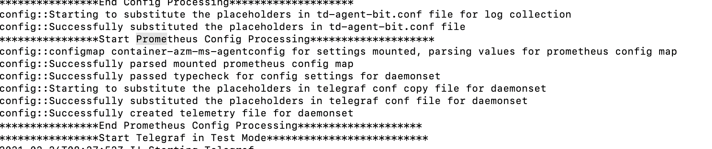

# Steps to Scrape Metrics into Log Analytics in Non-AKS Cluster

Save the Workspace ID and the key for log Analytics work space from the Azure dashboard.
Then, to use OMS Agent Daemonset and deployment:

1. Create the log analytics secrets with kubectl:

```bash
export LOG_ANALYTICS_GROUP={name_of_your_log_analytics_resource_group}
export LOG_ANALYTICS_NAME={name_of_your_log_analytics_workspace}

kubectl create secret generic omsagent-secret -n kube-system \
            --from-literal=KEY=$(az monitor log-analytics workspace get-shared-keys \
            -g $LOG_ANALYTICS_GROUP -n $LOG_ANALYTICS_NAME --query primarySharedKey -o tsv) \
            --from-literal=WSID=$(az monitor log-analytics workspace show \
            -g $LOG_ANALYTICS_GROUP -n $LOG_ANALYTICS_NAME --query customerId -o tsv)
# If you don't have az cli access, replace the $(az monitor...) portion with actual values from the portal
```

2. Check secrets created, run `kubectl get secrets omsagent-secret -n kube-system -o jsonpath='{.data}'`
3. Properly annotate target pods so that Prometheus can select and scrape the pod metrics. For details on proper annotations for OMS agent see [this link](https://docs.microsoft.com/en-us/azure/azure-monitor/containers/container-insights-prometheus-integration)

```bash
# Make sure --prometheus argument has been passed to ngsa-memory or ngsa-cosmos
# Otherwise, ngsa won't output Prometheus data to `/metrics` path

# Annotate the pod instance "ngsa-memory"
kubectl annotate pod ngsa-memory prometheus.io/scrape=true --overwrite prometheus.io/path='/metrics' prometheus.io/port=8080 prometheus.io/scheme=http interval=30s --overwrite

# Check ngsa-memory has the correct annotations
kubectl get pod ngsa-memory -o jsonpath='{.metadata.annotations}' | jq
```

4. Apply the OMS yaml files: `kubectl apply -f .`
5. Apply the OMS configMap: `kubectl apply -f ../container-azm-ms-agentconfig.yaml`
6. Check if resources are created properly:
    1. Configmap: `kubectl get cm container-azm-ms-agentconfig -n kube-system`
    2. Secrets:  `kubectl get secrets omsagent-secret -n kube-system`
    3. Daemonset: `kubectl get ds omsagent -n kube-system`
7. Check the OMS agent logs with command and it should indicate the Prometheus config processing
``` kubectl logs -f <omsagent-pod-name> --namespace kube-system ```

    
